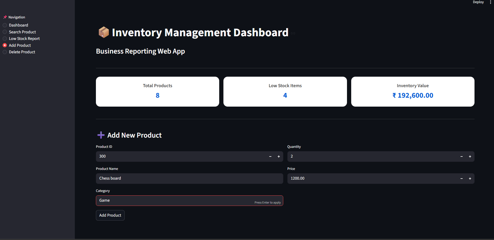

# SAP Inventory Report Dashboard

## Overview
This project is a SAP ABAP-inspired inventory management dashboard built using Python, SQLite, and Streamlit.

## Features
- View all products
- Search product by ID
- Low stock report
- Add new product
- Delete product
- Total inventory value dashboard

## Technologies Used
- Python
- SQLite
- Streamlit
- Pandas

## SAP Concept Mapping
- SQLite Table → SAP Custom Table (ZTABLE)
- SQL Query → ABAP SELECT
- Data Display → ABAP Report / ALV
- Search Input → ABAP PARAMETERS
- Business Logic → SAP Report Logic

## Screenshots

### Dashboard


### Low Stock Report


### Add Product Page


## Purpose
This project demonstrates the understanding of SAP-style data handling, reporting, and business process logic.

## Run the Project
```bash
python database.py
python -m streamlit run app.py
